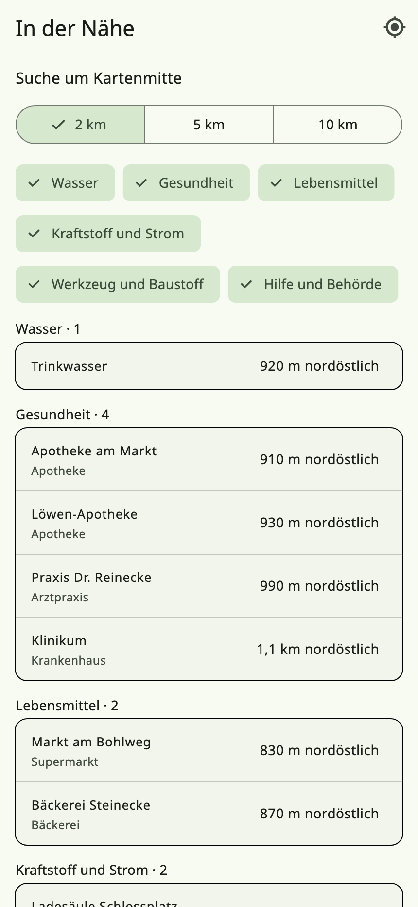
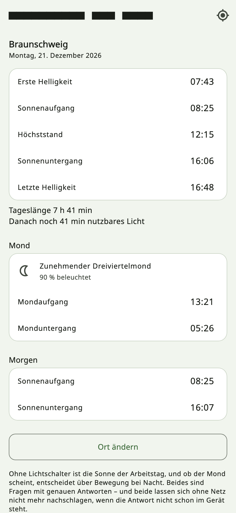
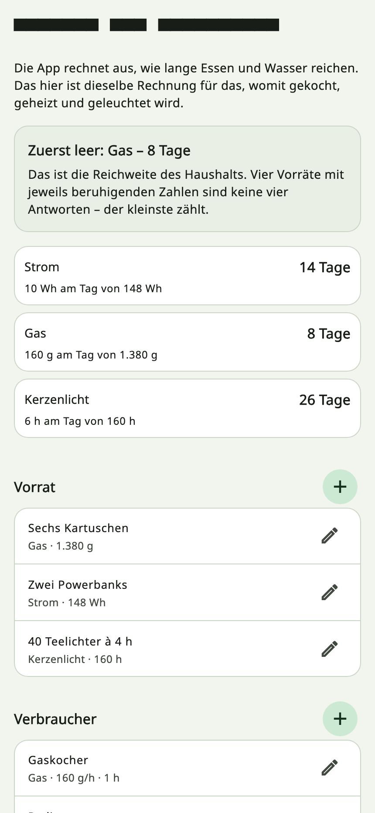
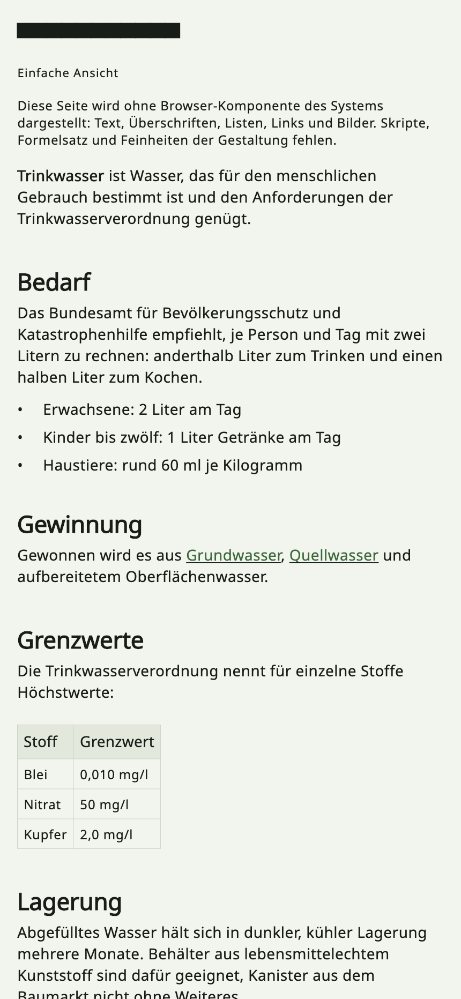
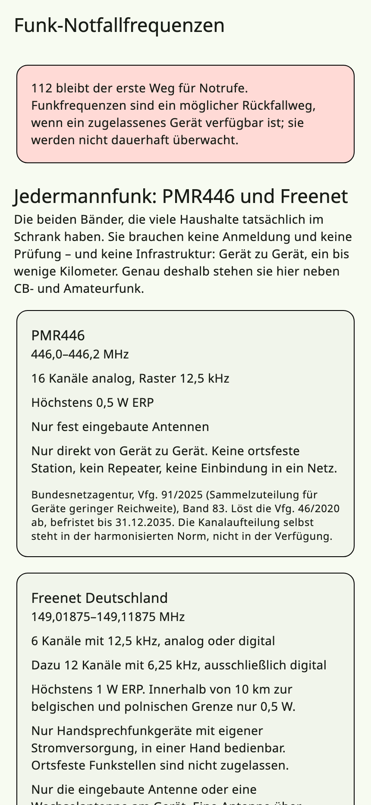

# PreppSuite

Vorrats- und Notfallplanung für den eigenen Haushalt – vollständig auf dem
eigenen Gerät.

Kein Konto, kein Server, keine Anmeldung. Die App speichert alles lokal und
holt sich nur das, was ohnehin öffentlich ist: amtliche Warnungen vom BBK und
von MeteoAlarm, Produktdaten von Open Food Facts, Karten und Schutzräume von
OpenStreetMap. Sie ist offline vollständig benutzbar.

## Bilder

| | |
|---|---|
|  |  |
| **In der Nähe** – gesucht in der heruntergeladenen Karte, ohne Netz. | **Tageslicht und Mond** – auf dem Gerät gerechnet, nichts abgefragt. |
|  |  |
| **Energie und Brennstoff** – welcher Vorrat zuerst leer ist. | **Wissen** – Artikel auch ohne Browser-Komponente des Systems. |



**Notfunk** – Frequenzen und Regeln, jeweils mit der Verfügung darunter,
aus der die Zahlen stammen.

Die Bilder entstehen aus den Widgets der App selbst, mit
`PREPPSUITE_SCREENSHOTS=1 flutter test test/screenshots` – dieselbe
Oberfläche, dasselbe Farbschema, nur mit Daten, die zeigen, wozu ein
Bildschirm da ist. So lassen sie sich nach jeder Änderung wieder erzeugen.

## Was sie kann

**Vorräte.** Artikel mit Menge, Einheit, Lagerort, Mindestbestand und
Ablaufdatum. Erfassung per Barcode über Open Food Facts, wahlweise mit
Foto. Bestehende Listen lassen sich als CSV einlesen, samt Behandlung
fehlerhafter Zeilen. Kategorien: Wasser, Lebensmittel, Medizin, Werkzeug,
Dokumente, Energie, Hygiene, Sonstiges. Vor dem Ablaufdatum erinnert die
App mit einstellbarem Vorlauf – für den ganzen Haushalt, und wo nötig für
einen einzelnen Artikel abweichend davon, bis hin zu „für diesen nie".
Verbrauchtes lässt sich direkt aus der Liste abbuchen.

**Wasser trinkbar machen.** Was Abkochen, Filtern und Entkeimungsmittel
leisten — und was nicht. Zuerst steht da, wogegen keines der drei hilft:
Treibstoff, Chemie und radioaktives Material bleiben drin. Danach das
Verfahren, nach WHO und CDC, mit den Grenzen dazu; Chlortabletten töten
Cryptosporidium nicht.

**Vorrats-Rechner.** Rechnet den Bestand gegen die Empfehlung des BBK –
2 Liter Trinkwasser und 2200 kcal pro Person und Tag – für eine
einstellbare Zahl an Tagen und Personen. Kinder bis zwölf zählen mit
1 Liter Getränken, wie es die Fußnote der Vorratstabelle der Bundesanstalt
für Landwirtschaft und Ernährung angibt; Hunde und Katzen mit der
tierärztlichen Faustregel von rund 60 ml je Kilogramm.

Die Nährwerte stehen **je 100 g** – oder je 100 ml bei Getränken –, genau
so, wie sie auf dem Etikett gedruckt sind. Alle fünf: Kalorien, Eiweiß,
Kohlenhydrate, Fett, Ballaststoffe. Hochgerechnet wird beim Rechnen, nicht
beim Eintragen.

Dafür wird bei **Lebensmitteln und Wasser** ein Maß als Einheit verlangt –
g, kg, ml oder l. „6 Dosen" hat kein Gewicht, bis jemand die Dose liest,
und eine Angabe je 100 g lässt sich darauf nicht anwenden. Bei
Medikamenten, Werkzeug und Dokumenten bleibt die Einheit frei: Tabletten
werden gezählt, nicht gewogen.

Vorhandene Posten in Dosen oder Gläsern bleiben stehen. Sie zählen nicht
in den Vorrats-Rechner, und die Krisenübersicht nennt sie, statt sie still
zu übergehen – geraten wird nichts. Die Vorratskarte sagt, wie viele das
sind, und beantwortet auf einen Tipp die Frage, die man dabei wirklich
hat: Nein, dein Vorrat wird nicht umgeschrieben. Die vier Einheiten im
Hinweis sind zum Antippen, nicht zum Abschreiben.

**Checklisten.** 21 mitgelieferte Listen nach dem BBK-Ratgeber – von
Wasser, Lebensmitteln und Erster Hilfe über Strom- und Heizungsausfall,
Hochwasser, Hitze und Sturm bis zu Haustieren, Säuglingen und
Falschmeldungen; eine davon, das Verhalten während eines Stromausfalls,
folgt FEMA – dazu beliebig viele eigene. Einzelne Punkte lassen sich
mit einem Vorratsartikel verknüpfen.

Getrennt nach **Vorsorge** und **Im Ereignis**: was da sein muss, bevor
etwas passiert, und was zu tun ist, während es passiert. Beides wird zu
verschiedenen Zeitpunkten gefragt, und die Antwort auf das eine sollte
nichts sein, an dem man vorbeiscrollt. „Strom- und Heizungsausfall" und
„Wenn der Strom ausfällt" stehen deshalb auf verschiedenen Seiten –
einmal, was zu kaufen ist, einmal, was zu tun ist. Dasselbe gilt seit
2.1.2 für Hochwasser und für Sturm: die alten Listen fragten nach
Rückstauklappe, Dach und Versicherung und lagen unter „Im Ereignis" –
wer mit steigendem Wasser nachsah, las als Erstes, er möge seine Police
prüfen. Die akuten Schritte stehen jetzt in „Hochwasser: wenn es soweit
ist" und „Sturm und Unwetter: wenn es soweit ist". Eigene Listen wählen
selbst, wohin sie gehören.

**Budget.** Was die Vorsorge gekostet hat, nach Kategorie. Dazu ein
PDF-Bericht der fehlenden Ausrüstung – der Bestände also, die unter ihrem
Mindestbestand liegen.

**Erste Hilfe.** Sechsundvierzig Anleitungen in Dringlichkeitsreihenfolge.
Siebzehn davon nach den Reanimations- und Erste-Hilfe-Leitlinien 2025 des
European Resuscitation Council, deutsche Fassung des German Resuscitation
Council: Notruf, bewusstlose Person, Wiederbelebung für Erwachsene, Kinder
und Säuglinge, Defibrillator, stabile Seitenlage, Ersticken, starke
Blutung, Schock, Verbrennung, Schlaganfall, Herzinfarkt, Krampfanfall,
allergischer Schock, Unterkühlung, Hitzschlag und Vergiftung – letztere
mit den Nummern der Giftinformationszentren.

Die übrigen neunundzwanzig folgen den *International first aid,
resuscitation and education guidelines 2025* der IFRC. Fünf davon sind
**seelische Not** — psychische Erste Hilfe nach Look – Listen – Link,
Suizidgedanken, Angst und Panikattacke, nach einem schweren Erlebnis,
akute Trauer — und tragen die Nummern der TelefonSeelsorge und der Nummer
gegen Kummer, jede zum Antippen. Dazu Ertrinken, Knochenbruch,
Wirbelsäulenverletzung, Kopfverletzung, abgetrenntes Körperteil,
Verletzung an Brust oder Bauch, Wunden, Nasenbluten, Tierbiss,
Zeckenstich, Insektenstich, Schlangenbiss, Quallenkontakt, Blasen,
ausgeschlagener Zahn, verblitzte Augen, Asthmaanfall, Pseudokrupp,
Unterzuckerung, drohende Ohnmacht, Fieber, Geburt ohne Hilfe,
Erfrierungen und Austrocknung. Neun Themen der Leitlinien sind bewusst
nicht dabei; welche und warum, steht in
[`docs/erste-hilfe.md`](docs/erste-hilfe.md). Dazu
Strichzeichnungen, die die App selbst zeichnet, und ein **Taktgeber für
die Herzdruckmassage** mit Ton, Blinken und Vibration, der den Bildschirm
anlässt. Alles davon ist beim ersten Start da, ohne Netz und ohne
Download. Videos sind ein eigenes, nachladbares Paket – siehe
[`docs/erste-hilfe.md`](docs/erste-hilfe.md). Die Anleitungen ersetzen
keinen Kurs und keinen Notruf, und jede nennt ihre Quelle.

Dazu **siebenundzwanzig Fragen**, jede auf einen Irrtum gezielt, den
Menschen wirklich haben: etwas zwischen die Zähne schieben, kalte
Gliedmaßen warm reiben, Eis auf eine Verbrennung, Erbrechen auslösen, eine
Tüte vor den Mund bei einer Panikattacke, erfrorene Finger an den
Heizlüfter, ein Light-Getränk bei Unterzuckerung, den Kopf in den Nacken
beim Nasenbluten, die Zecke mit Öl, das Gift aussaugen, den abgetrennten
Finger auf Eis, und die Sorge, das Fragen nach Suizidgedanken bringe
jemanden erst auf den Gedanken. Das Quiz darf nichts
wissen, was die Anleitungen nicht sagen – jede Begründung ist eine Warnung
oder ein Schritt daraus, wörtlich, und ein Test hält beide Sprachen
daran fest.

**Die Schritte vorlesen lassen.** Bei einer Wiederbelebung sind beide
Hände belegt und der Blick auch. Die Anleitungen lassen sich vorlesen, mit
demselben Gedanken wie der Taktgeber. Die Schaltfläche erscheint nur, wo
das Gerät wirklich sprechen kann: unter Linux gibt es dafür keine
Umsetzung, und ein Telefon ohne deutsche Stimme meldet das selbst.

**Warnungen.** Amtliche Meldungen für die eigene Region, im Banner über
allen Ansichten und als Verlauf. Quellen sind das BBK über
warnung.bund.de – alle sechs Kanäle, von MoWaS und DWD über Katwarn und
Biwapp bis Hochwasser und Polizei – sowie MeteoAlarm für 18 europäische
Länder. Abgefragt wird alle 15 Minuten; BBK-Warnungen werden bis auf
Kreisebene gefiltert, sodass ein Haushalt nicht die Meldungen des halben
Landes sieht.

Der Abruf läuft in der App selbst, nicht über einen Server – beide Quellen
sind öffentlich und ohne Schlüssel. Auf Android und iOS läuft er zusätzlich
im Hintergrund weiter, sodass Warnungen auch bei geschlossener App
ankommen. Android hält dabei ein Mindestintervall von 15 Minuten ein; auf
iOS entscheidet das System selbst, wann es den Abruf zulässt, was auch
Stunden dauern kann.

Bewusst ein Überblick, kein Alarm: NINA vom BBK stellt dieselben Meldungen
in rund 30 Sekunden zu. Wer sofort gewarnt werden will, nutzt dafür NINA –
die App sagt das an Ort und Stelle auch selbst.

**Von der Warnung zur Handlung.** Eine Warnung nennt ihr Ereignis — und
seit 2.1.2 führt sie von dort zu der Liste, die dazu gehört: „Hochwasser"
auf „Hochwasser: wenn es soweit ist", „Orkanartige Böen" auf „Sturm und
Unwetter". Der Weg nach draußen zur amtlichen Seite braucht einen Browser;
dieser braucht nichts. Wo keine Liste passt — Glatteis, Nebel, ein
Gefahrstoff —, bietet die App nichts an, statt das Nächstbeste
vorzuschlagen.

**Schutzräume.** Karte mit Schutzräumen und Bunkern aus OpenStreetMap und
der WWBOTA-Datenbank, nach Entfernung und nach Belastbarkeit der Angabe
filterbar.

**Notfall-Informationen.** Messwerte, die alt nichts mehr wert sind, und
jeder mit der Deutung der Stelle, die ihn veröffentlicht — nie mit einer
selbst erfundenen Skala:

- **Pegelstände** von PEGELONLINE, mit den Richtwerten des jeweiligen Pegels.
- **Gammastrahlung** aus dem ODL-Messnetz des Bundesamts für
  Strahlenschutz, gemessen gegen die eigene Wochen-Grundlinie der Station
  statt gegen einen bundesweiten Wert.
- **Luftqualität** nach dem Index des Umweltbundesamts, stündlich je
  Station.
- **Waldbrandgefahr** nach dem Index des Deutschen Wetterdienstes, heute
  und sechs Tage voraus.
- **Autobahnsperrungen** von der Autobahn GmbH, für die Strecken, die
  zählen. Baustellen ohne Sperrung bleiben draußen.

**In der Nähe.** Apotheke, Arzt, Trinkwasser, Supermarkt, Tankstelle,
Feuerwehr, Baumarkt — gesucht in der **heruntergeladenen Karte**, ohne
jedes Netz. Die einzige Suche in dieser App, die an dem Tag noch
antwortet, an dem die Schutzraumsuche, die Warnungen und die Pegel es
nicht mehr tun. Tankstelle und Ladesäule werden dabei streng
auseinandergehalten: In einer Stichprobe echter Kacheln kamen auf
18 Tankstellen 126 Ladesäulen, und wenn der Strom weg ist, sind das zwei
sehr verschiedene Antworten.

**Tageslicht und Mond.** Sonnenaufgang, Dämmerung, Höchststand,
Untergang, Mondauf- und -untergang und der beleuchtete Anteil — auf dem
Gerät gerechnet, nichts abgefragt, also auch am zehnten Tag ohne Netz
richtig.

Ohne Lichtschalter ist die Sonne der Arbeitstag, und ob der Mond scheint,
entscheidet über Bewegung bei Nacht.

Zweimal geprüft. Gegen die Tabellen der US Naval Observatory: bei 112
verglichenen Zeiten höchstens eine Minute daneben. Und seit 1.9.4 gegen
eine zweite Mondtheorie mit sechzig Termen, die mit der Reihe der App
keinen einzigen Term teilt – über ein ganzes Jahr an vier deutschen Orten
liegt der Median bei null Minuten und der schlechteste Fall bei drei. Die
Sonne trifft die Zeitgleichung an ihren beiden Extrema und an allen vier
Nulldurchgängen, und Berlins Sonnenwenden auf die Minute.

**Energie und Brennstoff.** Die zweite Hälfte des Vorrats-Rechners: wie
lange Strom, Gas, Brennstoff und Kerzenlicht reichen — und welcher Vorrat
zuerst leer ist, was die eigentliche Reichweite des Haushalts ist.
Geschätzt wird hier nichts: Was ein Kocher verbraucht, steht auf dem
Kocher. Die App teilt.

**Notfunk.** Frequenzen und Regeln für PMR446, Freenet, CB- und
Amateurfunk, jeweils mit der Verfügung darunter, aus der die Zahlen
stammen. Für PMR446 und Freenet gibt es **keinen amtlichen Anrufkanal**;
die verbreitete „Kanal 3"-Absprache steht als das da, was sie ist — eine
private Initiative.

**Wo man ist.** Die Karte konnte auf den blauen Punkt zentrieren; am
Telefon half das nichts. Vier Schreibweisen desselben Punktes, sortiert
danach, wer zuhört: **Grad, Minuten, Sekunden** für eine Leitstelle, die
zurückliest; **UTM** als Meter auf dem Gitter, wie Rettungsdienst,
Feuerwehr und THW arbeiten; **MGRS** als kurze Kennung desselben Gitters;
und ein **Plus Code**, zehn Zeichen, die jemand ohne jede Karte
weitergeben kann. Alles rechnet das Gerät selbst – kein Schlüssel, kein
Abruf, kein Netz. Die Genauigkeit steht dabei: zehn Meter sind eine
Haustür, achthundert das falsche Dorfende, und beide drucken gleich viele
Ziffern.

**Eigene Orte.** Treffpunkte, Brunnen, der Weg zu den Großeltern – als
GPX oder KML herein und wieder hinaus. Ein Plan, der die App nicht
verlassen kann, ist ein Plan, der mit der App endet. Dieselbe Datei
zweimal einzulesen fügt nichts doppelt hinzu.

**Um Hilfe blinken.** Der Bildschirm als Signallampe, in drei Rhythmen:
**SOS** in Morse – als *ein* Zeichen gesendet, nicht als drei Buchstaben –,
das **alpine Notsignal** mit sechs Zeichen in einer Minute und einer
Minute Pause, und die **Antwort** darauf, drei Zeichen in die Pause des
anderen hinein. Die Pause gehört zum Signal und steht auch so auf dem
Bildschirm: sie unterscheidet es von jemandem, der mit einer Lampe
herumläuft.

**Karte offline.** Im dunklen Erscheinungsbild ist auch die Karte dunkel –
der Stil wird umgedreht statt das fertige Bild, sodass ein Park grün bleibt.
Die Karte lässt sich in der App herunterladen: Ort
suchen – Stadt, Kreis, Bundesland oder Land – oder den Ausschnitt auf der
Karte einstellen, Detailstufe wählen, laden. Fertig ist ein
PMTiles-Archiv auf dem Gerät, und die Karte braucht kein Netz mehr. Die
Kacheln kommen von OpenFreeMap, frei und ohne Schlüssel, wahlweise auch von
MapTiler mit eigenem Konto. Eine selbst gebaute Datei geht weiterhin. Ohne
Archiv kommen die Kacheln wie bisher von OpenStreetMap. Einzelheiten in
[`docs/karte-offline.md`](docs/karte-offline.md).

**Wissen offline.** Eine ZIM-Datei – Wikipedia von Kiwix, eine
Themensammlung oder eigene Lernmaterialien – macht das Nachschlagen
unabhängig vom Netz. Der Kiwix-Katalog wird in der App durchsucht, nach
Sprache gefiltert und von dort geladen. Gesucht wird nach Titeln oder im
Text der Artikel; gelesen wird mit Bildern und Formatierung. Einzelheiten
in [`docs/wissen-offline.md`](docs/wissen-offline.md).

**Teilen.** Mehrere Geräte teilen sich Bestände, Listen und Budget über
einen Ordner, den sie alle sehen – Nextcloud, Syncthing, iCloud Drive,
Dropbox. PreppSuite legt dort nur Dateien ab; wer sie transportiert,
entscheidest du. Kein Konto, kein Einladungscode, kein Dienst dazwischen.

Mitgeteilt werden nicht nur die Zeilen, sondern auch **die Einstellungen des
Haushalts** – welcher Pegel gelesen wird, der Energieplan, die vereinbarten
Orte auf der Karte, wie weit im Voraus gewarnt wird. Nicht nur einmal bei der
Einrichtung, sondern laufend: Wer ändert, hat recht, und der spätere Wert
gewinnt. Was *dieses Gerät* betrifft – helles oder dunkles Bild, Sprache,
Benachrichtigungen – reist weiterhin nur einmal mit. Sonst würde der Rechner
dunkel, weil jemand im Zug das Telefon umgestellt hat.

Jedes Gerät schreibt genau eine Datei und liest alle anderen, sodass zwei
Personen nie dieselbe Datei beschreiben. Bei gleichzeitiger Änderung
derselben Zeile entscheidet eine feste Versionsreihenfolge. Einzelheiten samt Grenzen in
[`docs/gemeinsamer-ordner.md`](docs/gemeinsamer-ordner.md).

**Beitreten kommt vor dem Anlegen.** Die Ersteinrichtung fragt zuerst, ob
es den Haushalt schon auf einem anderen Gerät gibt, und bietet drei Wege:
neu anlegen, einen gemeinsamen Ordner öffnen oder den QR-Code des anderen
Geräts abfilmen. Das ist kein bequemerer Ort für dieselbe Sache, sondern
der einzige ungefährliche: Beitreten heißt, die fremde Haushaltskennung zu
übernehmen und **jede eigene Zeile darauf umzustempeln**. Auf einem Gerät,
das gerade erst eingerichtet wird, gibt es nichts umzustempeln. Später
muss die App fragen, was mit zwei verschiedenen Beständen geschehen soll –
und Zusammenführen lässt sich nicht rückgängig machen.

**Ohne Netz übertragen.** Zwei Wege für den Fall, dass es keinen
gemeinsamen Ordner gibt. Im selben Netz – WLAN, Hotspot, Campingplatz –
zeigt ein Gerät **einen** QR-Code mit Adresse und frischem Schlüssel; das
andere filmt ihn ab, und der Haushalt geht in einem Zug hinüber, in beide
Richtungen. Der Code ist dabei der Türschlüssel, nicht die Straße: Wer den
Bildschirm sieht, kommt herein, sonst niemand.

Und wenn auch das nicht da ist, zeigt ein Gerät eine **Folge** von
QR-Bildern in einer Schleife, das andere filmt sie ab. Das braucht nichts
außer einem Bildschirm und einer Kamera. Ein Haushalt mit zweihundert
Vorratszeilen sind etwa vier Bilder. Einzelheiten in
[`docs/ohne-netz-uebertragen.md`](docs/ohne-netz-uebertragen.md).

Beide Wege bringen seit 1.9.2 mehr mit als die Zeilen: **die Einstellungen
des Haushalts** – Profil, Region, Energieplan, Messstationen, Erinnerungs-
fristen. Übernommen werden sie nur von einem Gerät in der Ersteinrichtung;
ein Gerät, das schon in Benutzung ist, behält seine eigenen. Die
Geräteeinstellungen bleiben, wo sie sind: die Gerätekennung, alle lokalen
Dateipfade und der Karten-Schlüssel aus dem Schlüsselbund reisen nicht mit.

**Die Fotos gehen nur über die Direktübergabe** – den Weg über das örtliche
Netz. In der Bilderfolge wären es je Foto rund zweihundert zusätzliche
Einzelbilder zum Abfilmen, und im gemeinsamen Ordner würden dieselben Bytes
bei jedem Abgleich neu geschrieben. Die Gegenseite nennt, was sie schon
hat, also trägt eine zweite Übergabe nichts doppelt.

**Stromausfall.** Eine Uhr für das, was im Dunkeln wirklich gefragt wird:
wie lange Kühlschrank und Gefriergerät noch halten. Vier Stunden, 48 bei
vollem und 24 bei halbvollem Gefriergerät, dazu die Zwei-Stunden-Regel ab
4 °C. Die Zahlen stammen von FEMA und der USDA und stehen mit ihrer
Quelle auf dem Bildschirm – eine deutsche Behörde veröffentlicht dazu
keine. Die Uhr läuft über einen Neustart hinweg weiter.

**Medikamente.** Dieselbe Reichweitenrechnung wie bei Vorräten und
Brennstoff: Bestand geteilt durch Tagesverbrauch, mit dem, was zuerst
leer ist, ganz oben. Die Dosis kommt von der Packung; Medikamente ohne
Tagesverbrauch werden genannt statt stillschweigend übergangen.

**Hausratverzeichnis.** Was der Haushalt besitzt – Gegenstand, Raum,
Seriennummer, Kaufdatum, Preis, Foto –, gruppiert nach Raum und mit
Summen je Währung. Nicht der Vorrat, sondern was eine Versicherung nach
einem Brand wissen will. Die PDF-Ausgabe ist dafür gedacht, außerhalb der
Wohnung aufbewahrt zu werden.

Was die US-Behörden darüber hinaus aufführen und warum das meiste davon
schon abgedeckt war, steht in
[`docs/us-behoerden-abgleich.md`](docs/us-behoerden-abgleich.md).

Ein Funkchat über LoRa an Menschen außerhalb des Haushalts ist **geplant,
aber nicht gebaut**. Der Entwurf samt der Rechnung, warum darüber kein
Haushaltsabgleich läuft, steht in
[`docs/lora-funkchat-plan.md`](docs/lora-funkchat-plan.md).

**Notfallkarten.** Für jede Person im Haushalt das, was ein Rettungsdienst
wissen will: Geburtsjahr, Blutgruppe, Allergien, Dauermedikation,
Vorerkrankungen, Versicherung. Dazu **mehrere Ärztinnen und Ärzte** und
**mehrere Personen, die man wegen dieser Person anruft** – je mit Namen,
Verhältnis oder Fachrichtung und Rufnummer, die sich direkt wählen lässt.
Nötig ist nur der Name: eine Karte, auf der nichts steht außer „Lena,
Penicillinallergie", ist es wert. Das sind Gesundheitsdaten, und der
Bildschirm sagt vor dem ersten Buchstaben, ob der gemeinsame Ordner, über
den sie wandern, verschlüsselt ist.

**Übersicht mit zwei Ampeln.** Oben auf dem ersten Bildschirm: *Vorrat* gegen
die Werte des BBK – zehn Tage, 2 l und 2200 kcal je Person und Tag –, und
*Lage* mit der höchsten amtlichen Warnstufe, die gerade für eure Bereiche
gilt. Verrechnet werden die beiden nicht: „Vorrat reicht, aber Unwetter" hat
keine gemeinsame Farbe. Grau heißt „zu wenig eingetragen, um etwas zu sagen",
nicht rot – eine leere Datenbank ist kein leerer Keller. Und auf der
Lage-Ampel gibt es kein Grün: Behörden veröffentlichen Warnungen, keine
Entwarnungen.

**Suchen.** Eine Lupe über die ganze App: Bildschirme, Vorräte,
Checklistenpunkte und Hausrat. Jeder Treffer sagt, wo er liegt – „Pegel ·
Warnungen", „Basmatireis · Keller" –, denn beim nächsten Mal soll man es
selbst finden. Wer „Hochwasser" tippt, bekommt den Pegel, auch wenn das
Wort nirgends im Titel steht; wer die Umlaute weglässt, bekommt trotzdem
das Notgepäck. Die Notfallkarten sind absichtlich nicht dabei: eine
Diagnose gehört nicht zwei Zeilen unter eine Dose Bohnen. Am Rechner mit
Strg+F oder Strg+K, auf dem Telefon im Mehr-Menü.

**Verschlüsselte lokale Daten.** Der Haushalt, die Warnungen, der
Dokumentindex — die Datenbanken auf dem Gerät liegen verschlüsselt, mit
einem Schlüssel aus dem Schlüsselbund des Systems. Eine neue Installation
fängt so an. Eine bestehende stellt **niemand außer dir** um: die Karte
„Lokale Verschlüsselung" in den Einstellungen lässt den Schritt erst zu,
wenn die App eine Sicherung vor deinen Augen wieder aufgemacht hat. Nicht
verschlüsselt sind die Dateien, die du selbst hineingelegt hast — PDFs,
Karten, ZIM-Archive, Fotos — und alles, was du exportierst; das steht auch
so auf der Karte. Findet ein Gerät seinen Schlüssel nicht mehr, sagt die
App das, statt in einem Fehler zu enden, und benennt beim Neuanfang die
unlesbaren Dateien um, statt sie zu löschen.

Mitverschlüsselt sind seit 2.0.1 auch die persönlichen Werte, die neben der
Datenbank liegen: Profil, beobachtete Regionen, eigene Kartenpunkte, der
Krisenplan, die Liste eigener Dokumente und der Schlüssel zum gemeinsamen
Ordner. Sprache, Farbschema und die Zwischenspeicher öffentlicher Daten
bleiben lesbar — die App muss einen Bildschirm zeichnen können, bevor sie
etwas geöffnet hat. Ein **mitgeführter Datenordner** wird nicht
verschlüsselt: sein Schlüssel könnte nicht mitreisen, und ein Ordner, der
sich am nächsten Rechner nicht öffnen lässt, ist das Gegenteil von dem,
wofür es ihn gibt.

Die Sicherung nimmt seit 2.0.1 Profil und Einstellungen mit. Das ist
zugleich der Weg zurück, wenn ein Gerät seinen Schlüssel verliert: beim
Einrichten steht „Aus einer Sicherung wiederherstellen", und der Haushalt
kommt mit seiner bisherigen Kennung zurück statt als fremder abgewiesen zu
werden.

Oberfläche auf Deutsch und Englisch, helles und dunkles Erscheinungsbild.
Auf einem breiten Fenster legen sich die Bildschirme in Spalten lesbarer
Breite nebeneinander, statt eine einzelne Spalte über die ganze Breite zu
ziehen; auf dem Telefon bleibt alles wie es war.

## Installieren

Fertige Fassungen für **macOS, Windows, Linux und Android** liegen unter
*Releases*. Weiterzugebende macOS- und Windows-Pakete entstehen ausschließlich
über die Signatur-Skripte in [`docs/desktop-bauen.md`](docs/desktop-bauen.md):
macOS wird mit einer Developer-ID signiert und notariert, Windows mit einem
Authenticode-Zertifikat inklusive Zeitstempel. Fehlen diese lokalen
Zugangsdaten, bricht der Release-Schritt ab, statt ein Paket als produktiv
auszugeben. Die Android-Pakete *sind* signiert.

### Von einem Datenträger betreiben

Die App kann ihre Daten in einem Ordner neben dem Programm halten statt
dort, wo das Betriebssystem sie sonst ablegt. Damit läuft dieselbe
Installation von einer externen Platte oder einem Stick — auch an einem
fremden Rechner.

Unter **Windows und Linux** genügt ein Ordner namens `PreppSuite-Daten`
neben dem Programm; der nächste Start benutzt ihn. Für beide liegt unter
*Releases* auch eine Fassung, die den Ordner schon mitbringt
(`…-portabel.zip` beziehungsweise `…-portabel.tar.gz`). Unter **macOS**
wird er einmal je Mac ausgewählt, weil die App in der Sandbox läuft und
dort keinen Ordner neben dem eigenen Bündel lesen darf.

Nichts wird von allein angelegt — eine installierte Fassung verhält sich
genau wie bisher. Karten, Archive und Dokumente auf demselben Datenträger
werden relativ gemerkt und deshalb auch dann wiedergefunden, wenn er am
nächsten Rechner unter einem anderen Buchstaben erscheint. Einzelheiten in
[`docs/mitgefuehrte-fassung.md`](docs/mitgefuehrte-fassung.md).

Selbst bauen:

```bash
flutter pub get
cd preppsuite_flutter
flutter build macos --release      # oder apk, ios, ...
```

### Android weitergeben

Die Release-APK wird mit dem Debug-Schlüssel signiert, solange kein eigener
vorliegt. Zum Ausprobieren reicht das; zum Weitergeben nicht, denn das
Passwort dieses Schlüssels ist der öffentlich bekannte Wert `android` – jeder
könnte damit eine gefälschte Aktualisierung signieren.

Einen eigenen Schlüssel erzeugen (einmalig, außerhalb des Repositorys):

```bash
keytool -genkeypair -v -keystore ~/.android-keystores/preppsuite-release.jks \
  -keyalg RSA -keysize 4096 -validity 10000 -alias preppsuite
```

Dazu `preppsuite_flutter/android/key.properties` mit `storeFile`,
`storePassword`, `keyPassword` und `keyAlias` anlegen – die Datei ist
ignoriert und bleibt lokal. Fehlt sie, warnt der Build und fällt auf den
Debug-Schlüssel zurück.

**Der Schlüssel ist unersetzlich.** Geht er verloren, lässt sich für alle, die
die App installiert haben, nie wieder eine Aktualisierung veröffentlichen.
Keystore und Passwörter gehören an zwei getrennte gesicherte Orte.

Es entstehen **zwei Pakete, eines je Architektur**, und jedes enthält nur
seine eigene. Ein Paket mit beiden war 64,7 MB, davon 60,2 MB nativer Code
für zwei Architekturen – jedes Telefon lud und installierte also knapp
29 MB, die es nie ausführen kann. Getrennt und gemessen: `arm64-v8a`
35,9 MB, `armeabi-v7a` 32,9 MB.

Weitergegeben wird im Normalfall **arm64-v8a**; das ist jedes Telefon der
letzten Jahre. `armeabi-v7a` ist für die Handvoll älterer Geräte, die
minSdk 24 noch zulässt.

x86 und x86_64 sind der Emulator und landen auf keinem Gerät, an das diese
App weitergegeben wird. `tool/android_release.sh` baut mit
`--target-platform` und prüft jedes Paket einzeln darauf, genau eine
Architektur zu enthalten – ein Paket, das beide trägt, hätte die 29 MB
zurück, und eines mit der falschen installiert sich und startet dann
nicht.

**Die Aufteilung ist eine Einbahnstraße.** `--split-per-abi` rechnet je
Architektur 1000 auf den `versionCode`: aus `+22` in der pubspec wird 1022
für `armeabi-v7a` und 2022 für `arm64-v8a`. Über die bestehenden
Installationen mit 22 lässt sich damit aktualisieren – zurück aber nicht.
Ein späteres Paket mit beiden Architekturen trüge wieder eine schlichte
23, und die weist jedes Telefon, das inzwischen auf 2022 steht, als
Rückschritt ab; der einzige Ausweg wäre Deinstallieren samt Daten. Das
Skript prüft den Offset deshalb ausdrücklich und bricht ab, wenn er fehlt.

#### Schlüsselwechsel: warum `flutter build apk` allein nicht reicht

Bis 0.10.0 trug die APK den Debug-Schlüssel. Android verweigert eine
Aktualisierung, deren Zertifikat von dem der Installation abweicht – ein
schlichter Wechsel hätte alle Bestandsinstallationen zum Deinstallieren
gezwungen, mitsamt ihrer Daten.

Der Ausweg heißt *Signaturschema v3*: `android/signing-lineage.bin` ist ein
vom Debug-Schlüssel unterschriebener Nachweis, dass er den heutigen Schlüssel
als Nachfolger anerkennt. Steckt der im Paket, nimmt Android die
Aktualisierung an.

Das Android-Gradle-Plugin kann diesen Nachweis **nicht** anhängen. Deshalb
wird die weiterzugebende APK nicht von `flutter build apk --release` gebaut,
sondern von:

```bash
./tool/android_release.sh
```

Das Skript baut, signiert mit der Lineage nach und weist nach, welches
Zertifikat in welcher Spanne gilt, bevor es etwas ablegt:

| Android | Schema | Zertifikat |
|---|---|---|
| 7 bis 12 (API 24–32) | v2 | `CN=Android Debug` |
| 13 und neuer (API 33+) | v3.1 | `CN=PreppSuite` |

**Die Grenze liegt bei 13, nicht bei 9.** apksigner legt eine Rotation
standardmäßig in einen *v3.1*-Block, und den liest erst Android 13. Android 9
bis 12 ließen sich mit `--rotation-min-sdk-version 28` erreichen – aber deren
Rotationsbehandlung ist gerade der Grund, aus dem es v3.1 gibt, und eine
fehlgeschlagene Installation hat bei einer selbst verteilten App keinen
Rückweg. Bewusst auf der sicheren Vorgabe belassen.

Beides zusammen heißt: solange `minSdk` bei 24 liegt, ist der Debug-Keystore
(`~/.android/debug.keystore`) **kein Überbleibsel, sondern Teil der
Signatur.** Er gehört gesichert wie der eigentliche Schlüssel; geht er
verloren, ist für Android 7 bis 12 keine Aktualisierung mehr möglich. Erst ein
`minSdk` von 33 macht ihn entbehrlich.

Die App trägt die Kennung `de.status403.preppsuite`. Wer eine eigene Fassung
über den App Store verteilen will, braucht eine eigene unter einer Domain, die
er selbst kontrolliert.

## Aufbau

Ein Paket, `preppsuite_flutter`. Darin liegt der Code nach Funktion
getrennt: `lib/local_db` die Datenbank, `lib/model` die einfachen Typen,
`lib/features/<name>/application` die Logik und `presentation` die
Oberfläche.

Daneben `third_party/`. Was dort liegt, gehört nicht diesem Projekt: es
liegt dort, weil die veröffentlichte Fassung einen Fehler hat, den wir
nicht umgehen können, und weil es keine neuere gibt. Derzeit betrifft das
`flutter_tts`, dessen Windows-Teil die App beim Start mitnahm. Was geändert
wurde und was beim Nachziehen zu tun ist, steht in
[`third_party/LIESMICH.md`](third_party/LIESMICH.md).

Die Anwendung liest ausschliesslich aus einer lokalen Datenbank auf dem
Gerät. Änderungen bekommen dort eine Kennung und werden als offen
markiert; gelöscht wird nur als Merker, damit die Löschung auch auf den
anderen Geräten ankommt. Der Abgleich über den gemeinsamen Ordner läuft
daneben und schreibt in dieselbe Datenbank.

Die Annahmen, die dahinterstehen, sind in
[`ARCHITEKTUR.md`](ARCHITEKTUR.md)
aufgeschrieben, die Warnquellen in
[`docs/warning-feeds.md`](docs/warning-feeds.md), das Ordnerformat in
[`docs/gemeinsamer-ordner.md`](docs/gemeinsamer-ordner.md), die
Offline-Karte in [`docs/karte-offline.md`](docs/karte-offline.md), die
Wissensdatei in [`docs/wissen-offline.md`](docs/wissen-offline.md), die
Erste Hilfe samt Videopaket in
[`docs/erste-hilfe.md`](docs/erste-hilfe.md) und der
Betrieb von einem Datenträger in
[`docs/mitgefuehrte-fassung.md`](docs/mitgefuehrte-fassung.md).

## Entwicklung

```bash
flutter pub get                                   # im Wurzelverzeichnis
flutter analyze
dart format --output=none --set-exit-if-changed .

cd preppsuite_flutter && flutter test
```

Vor einem Release läuft lokal dieselbe vollständige Sperre in einem Schritt:

```bash
./tool/pre_release_check.sh
```

Sie prüft die erreichbare Git-Historie auf personenbezogene Kennungen,
Formatierung, statische Analyse und die Testsuite. Sie benötigt keinen
externen CI-Runner.

Die mobile CI (`.github/workflows/test-mobile.yml`) führt die nativen
Speicher- und Webview-Tests auf einem Android-Emulator und einem iOS-Simulator
aus. Lokal startet `python3 tool/run_ios_integration.py` einen verfügbaren
iPhone-Simulator und beendet ihn danach wieder, sofern das Skript ihn
selbst gestartet hat. Echte Hintergrundzustellung und der interaktive
Ordner-Picker benötigen weiterhin Tests auf physischen Geräten.

Nach jeder Änderung an einer Tabelle:

```bash
cd preppsuite_flutter && dart run build_runner build
```

## Lizenz

Der Projektcode steht unter der Lizenz in [LICENSE](LICENSE).

Die Daten stammen aus fremden Quellen und stehen unter deren eigenen
Bedingungen: Kartenkacheln und Schutzraum-Einträge von OpenStreetMap
(ODbL, Namensnennung in der Karte), Produktdaten von Open Food Facts
(ODbL), Warnungen vom BBK und von MeteoAlarm, Ortssuche über Nominatim.
Das Kartenbild der Offline-Karte stammt von OpenMapTiles (CC-BY 4.0),
abgeleitet von OSM Liberty.
Die mitgelieferte Schrift Noto Sans steht unter der SIL Open Font License
(`preppsuite_flutter/assets/fonts/OFL.txt`).

## Stand

Die App ist im Alltag benutzbar, einige Kanten sind aber bekannt:

- Auf Android geht die Freigabe eines Ordners bei einer Neuinstallation
  verloren und lässt sich in den Systemeinstellungen entziehen. Die App
  merkt das beim nächsten Abgleich und sagt es; der Ordner wird dann
  einmal neu gewählt.
- Der Abgleich ist kein Echtzeit-Abgleich: alle zwei Minuten, beim Start und
  beim Zurückkehren in die App – dazu die Laufzeit des Dienstes, der die
  Dateien transportiert.
- Die Ordner-Verschlüsselung ist optional und schützt die geteilten
  Gerätedateien. Beim Aktivieren müssen alle Geräte ihre bisherigen
  Klartextdateien neu veröffentlichen; alte Cloud-Versionen verschwinden
  dadurch nicht.
- Die **lokale** Datenbank lässt sich seit 2.1.2 verschlüsseln, unter
  Einstellungen → Daten und Sicherheit. Sie ist nicht von allein
  verschlüsselt: die Umstellung wird ausdrücklich gestartet und verlangt
  vorher einen Sicherungstest. **Auf macOS greift sie derzeit nicht** —
  ohne Signaturzertifikat nimmt der Schlüsselbund nichts an, und die App
  sagt das an Ort und Stelle, statt eine Umstellung anzubieten, die
  scheitern würde.
- Deutsche MeteoAlarm-Gebiete werden über die DWD-Gebietsliste auf Kreise
  abgebildet. Nicht zuordenbare Gebiete und Meldungen anderer Länder gelten
  für das ganze Land. BBK-Warnungen werden bis auf Kreisebene gefiltert.
- BBK-Warnungen haben kein Ablaufdatum und werden beendet, wenn sie aus
  einem vollständigen BBK-Abruf verschwinden. MeteoAlarm liefert dagegen
  `cap:expires`, das die App übernimmt. Einzelheiten in
  [`docs/warning-feeds.md`](docs/warning-feeds.md).
- Der Hintergrundabruf ist auf Android verlässlich (15 Minuten Mindestabstand,
  eine Vorgabe der Plattform) und auf iOS nur gelegentlich – dort entscheidet
  das System. Für sofortige Warnungen ist NINA vom BBK die richtige Antwort,
  die App sagt das auch selbst.
- Die Offline-Karte kennt ein Kartenbild, hell, ohne Piktogramme an Punkten
  und ohne Höhenrelief. Sie braucht ein Archiv im OpenMapTiles-Schema; die
  fertigen `.pmtiles` aus dem Netz sind meist Protomaps-Schema und werden
  beim Auswählen abgelehnt. Deshalb baut die App sich das Archiv selbst –
  aus einem Ort, den man beim Namen sucht, oder aus dem Ausschnitt auf der
  Karte, von OpenFreeMap (frei und ohne Schlüssel) oder von MapTiler (mit
  eigenem Schlüssel). Ein ganzes Land geht gestaffelt – außen gröber, um
  den gewählten Ort herum voll –, flach dagegen nicht: über 100 000
  Kacheln lehnt die App ab, aus Rücksicht auf einen öffentlichen Server.
  Speicherplatz ist nie die Grenze. Ein unterbrochener Download wird beim
  nächsten Start fortgesetzt statt neu begonnen. Einzelheiten in
  [`docs/karte-offline.md`](docs/karte-offline.md).
- Die Volltextsuche nutzt seit 0.15.0 den Index, den ein Kiwix-Archiv
  ohnehin mitbringt – auf macOS, Linux und Windows. Gemessen an der
  vollständigen deutschen Wikipedia: 3,2 Millionen Artikel, nichts
  aufzubauen, eine Suche in wenigen Millisekunden, und „Notvorräte"
  findet „Notvorrat".
- Unter Android – und bei Archiven ohne eigenen Index – baut die App
  weiterhin einen eigenen auf. Der kennt seit 0.15.0 ebenfalls deutsche
  Wortstämme, über denselben Algorithmus in Dart statt über eine
  C++-Bibliothek. Für eine Themensammlung sind das Minuten,
  für die vollständige Wikipedia eher eine Stunde und mehrere Gigabyte.
  Anhalten geht jederzeit; das Angefangene bleibt durchsuchbar. Dieser
  Index kennt keinen deutschen Wortstamm.
- Artikel öffnen unter Linux und Windows ein eigenes Fenster statt eines
  Bereichs in der App, weil dort keine eingebettete Browser-Komponente
  erreichbar ist. **Fehlt die Komponente des Systems** — WebView2 unter
  Windows, `libwebkit2gtk-4.1-0` unter Linux —, **zeichnet die App den
  Artikel seit 1.8.0 selbst**: Text, Überschriften, Listen, Tabellen,
  Links und Bilder, ohne Skripte und ohne Formelsatz. Beides ist unter
  Einstellungen wählbar. Warum die Bibliothek nicht einfach beiliegt,
  steht in [`docs/wissen-offline.md`](docs/wissen-offline.md).
- Der Schlüssel für die lokale Verschlüsselung liegt im Schlüsselspeicher
  des Systems. Unter Linux ist das `libsecret-1-0`; die Bibliothek liegt
  dem Paket nicht bei, weil sie zum Sitzungsdienst gehört und nicht zur
  Anwendung. **Fehlt sie**, startet die App trotzdem und arbeitet
  unverschlüsselt weiter — das steht dann auch so auf der Karte „Lokale
  Verschlüsselung". Eine bereits verschlüsselte Installation sagt
  stattdessen, dass sie ihren Schlüssel nicht findet, und rührt nichts an.

- Fotos zu Vorratsartikeln liegen im gemeinsamen Ordner **nicht** – dort
  stehen nur die Daten. Auf einem mitgeführten Datenträger wandern sie mit,
  und seit 1.9.2 gehen sie auch über die Direktübergabe im örtlichen Netz
  auf ein zweites Gerät. Über die QR-Bilderfolge gehen sie nicht.
- Veröffentlicht werden **macOS, Windows, Linux und Android**, jeweils aus
  einem Bau auf der echten Maschine. Die Android-Pakete tragen seit 0.11.0
  den eigenen Schlüssel mit der Signaturkette; die Desktop-Bauten sind
  nicht signiert. Für **iOS** ist geprüft, dass die App durchbaut, und sie
  läuft auf dem Simulator; ausgeliefert wird sie nicht. iOS verlangt
  mindestens iOS 14 – `workmanager` bringt die Grenze mit. Was Linux und
  Windows zum Bauen brauchen, steht in
  [`docs/desktop-bauen.md`](docs/desktop-bauen.md). Web bräuchte Umbau:
  der Foto-Teil verwendet `dart:io`.
